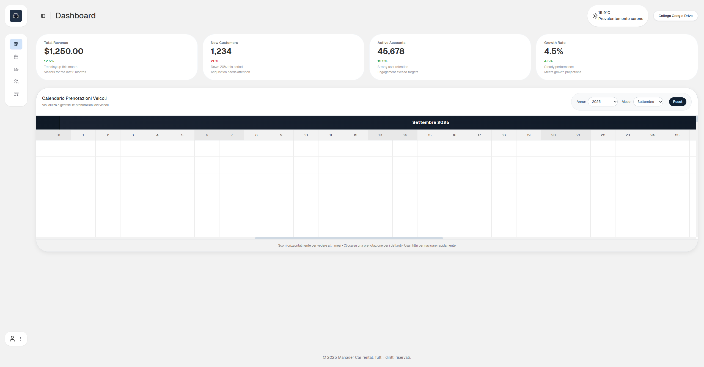

# 🚗 Rental Car Manager

[](https://laravel.com)
[](https://www.php.net)
[](https://opensource.org/licenses/MIT)

> ⚠️ **Work in Progress**: Questo progetto è in fase di sviluppo. Alcune funzionalità potrebbero essere incomplete o soggette a cambiamenti.

**Rental Car Manager** è un'applicazione web costruita con Laravel per gestire in modo semplice ed efficiente un sistema di noleggio auto. Offre tutte le funzionalità fondamentali per amministrare veicoli, clienti e prenotazioni attraverso una dashboard intuitiva.

[](./asset/Rental Car Manager Presentation.pdf)

## ✨ Caratteristiche Principali

-   👥 **Gestione Clienti**: Anagrafica completa dei clienti con storico delle prenotazioni e dettagli di contatto.
-   🚗 **Gestione Parco Veicoli**: Aggiungi, modifica, e visualizza lo stato di ogni veicolo (disponibile, in manutenzione, noleggiato).
-   📅 **Sistema di Prenotazioni**: Crea e gestisci le prenotazioni, con un calendario per verificare la disponibilità dei veicoli.
-   📈 **Dashboard Amministrativa**: Una vista d'insieme con statistiche chiave, ultime prenotazioni e report.
-   🔐 **Autenticazione Sicura**: Sistema di login e registrazione basato su Laravel per proteggere l'accesso.

## 🛠️ Tecnologie Utilizzate

-   **Backend**: [Laravel 10](https://laravel.com/)
-   **Frontend**: Template engine [Blade](https://laravel.com/docs/10.x/blade) con HTML/CSS (facilmente personalizzabile con Tailwind CSS, Bootstrap, etc.)
-   **Database**: MySQL / MariaDB (configurabile tramite file `.env`)
-   **Gestione Dipendenze**: [Composer](https://getcomposer.org/)

## 📜 Licenza

Questo progetto è distribuito con licenza MIT. Vedi il file `LICENSE` per maggiori dettagli.

## 👨‍💻 Autore

**Paolo-sc**

-   [GitHub](https://github.com/Paolo-sc)
-   [LinkedIn](https://www.linkedin.com/in/tuo-profilo/) ```
